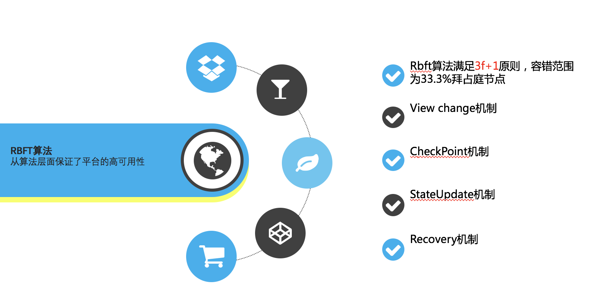
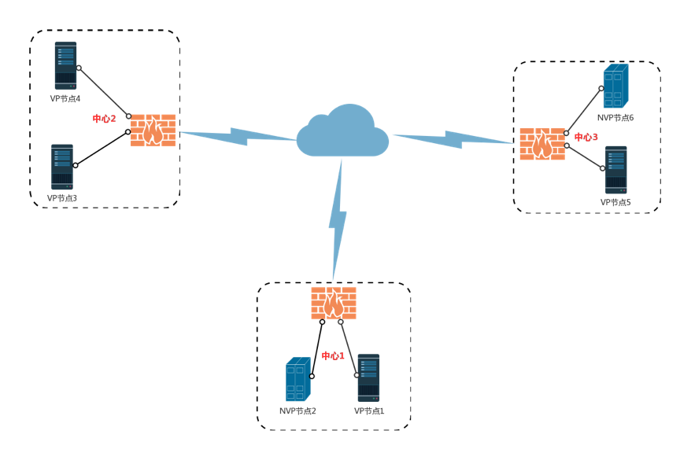
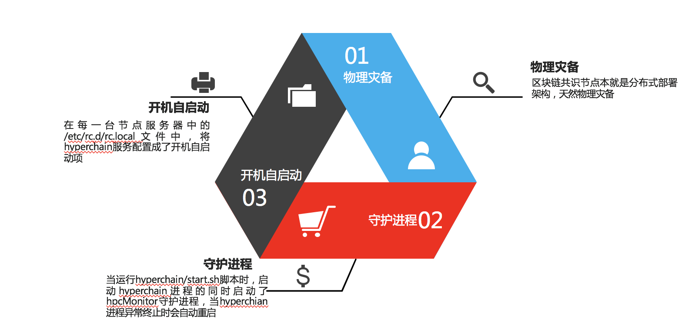

区块链平台解决方案_FQA
=====================

1.节点数据容错解决方案
---------------------
算法容错
~~~~~~~~~~
在hyperchain联盟链中，平台容错节点数量f满足3f+1<=n（n为联盟链节点个数），即当整个联盟链为5个节点的时候，允许1个节点出故障，当整个联盟链有7个节点的时候，允许两个节点出故障。
当异常节点个数不超过f个，其余节点均可接受交易并进行共识。在排查异常节点问题之后，重启异常节点，异常节点将开启recovery机制进行自我恢复。
|image0|

hyperchainSDK容错
~~~~~~~~~~~~~~~~~
HyperChain SDK为连接上层应用与Hyperchain平台的桥梁，上层应用使用Java SDK完成平台提供的各种基本功能。SDK提供相应的外部接口，将应用给出的参数进行封装、加密、签名等，
形成http请求后发送给平台，平台收到请求后返回结果，然后SDK对返回的结果进行解析，返回给上层。
HyperChain SDK在建立平台连接时，会选择所有配置的节点中健康的节点进行交易请求，避免向异常节点发起请求。

网络拓扑与物理灾备
~~~~~~~~~~~~~~~~~
可以按如下网络拓扑对hyperchain灾备方案进行说明
|image1|
其中，vp节点指的是共识节点，nvp节点指的是非共识节点，不参与联盟链共识，但是会从vp节点同步区块。
网络拓扑中，包含三个中心，分别命名为中心1，2，3。每个中心附带两个hyperchain节点，一个为VP节点，一个为NVP节点。三个中心的节点通过互联网或者专线进行网络传输。

**外部容错**

在hyperchain平台部署时可开启守护进程，并启动开机自启服务，
|image2|

